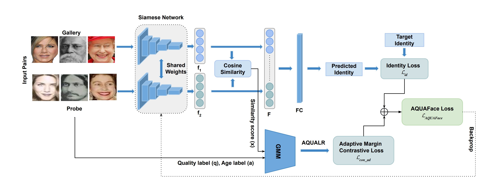

<div align="center">

# *AQUAFace* : Age-Invariant Quality Adaptive Face Recognition for Unconstrained Selfie vs ID Verification  
<h3><strong>AAAI 2025</strong></h3>

Shivang Agarwal<sup>*1</sup>  &emsp; Jyoti Chaudhary<sup>*1</sup>  &emsp; Sadiq Siraj Ebrahim<sup>1$</sup>  &emsp; Mayank Vatsa<sup>1</sup>  &emsp; 

Richa Singh<sup>1</sup>  &emsp; Shyam Prasad Adhikari<sup>2+</sup>  &emsp; Sangeeth Reddy Battu<sup>2+</sup> &emsp;   

<sup>1</sup>IIT Jodhpur, <sup>2</sup>Swiggy

<sup>*</sup>Equal Contribution, <sup>+</sup>Work done while at Swiggy, 
<sup>$</sup>Work done as a part of summer internship at IITJ

<a href='https://sadiqebrahim.github.io/AQUAFace/'></a>
<a href='https://ojs.aaai.org/index.php/AAAI/article/view/32165'></a>
<!---<a href='https://huggingface.co/your-model-link'></a>
--->

</div>
<hr />

## Contributions

**AQUAFace** is a novel face recognition framework that adapts to **age variations** and **image quality discrepancies** — two major challenges in selfie vs ID verification. It introduces the **Age and Quality Likelihood Ratio (AQUALR)** to enhance model performance across diverse domains.

The key contributions of our work are,<br>
1️⃣ AQUALR: A Gaussian Mixture Model (GMM)-based module computes an Age and Quality Likelihood Ratio (AQUALR), integrating age and quality labels into pairwise similarity scores. This enables dynamic sample weighting based on age and quality variations.<br>
2️⃣ Adaptive Contrastive Loss: The loss dynamically adjusts margins using AQUALR to penalize harder samples characterized by large age differences or low quality, enhancing intra-class compactness and inter-class separation.<br>
3️⃣ Identity Preservation: A fine-tuned ArcFace model ensures robust identity-related feature extraction, utilizing margin-based softmax loss to maintain discriminative power under diverse variations. The combined loss function integrates these components to optimize for both identity preservation and resilience against age and quality changes. The framework incorporates real and synthetic datasets for training, using synthetic data fine-tuning to enrich intra-class variability. The architecture leverages a Siamese network with shared weights and cosine similarity for feature comparison, achieving state-of-the-art performance across benchmark datasets.


> **<p align="justify"> Abstract:** *Face recognition in the presence of age and quality variations poses a formidable challenge. While recent margin-based loss functions have shown promise in addressing these variations individually, real-world scenarios such as selfie versus ID face matching often involve simultaneous variations of both age and quality. In response, we propose a comprehensive framework aimed at mitigating the impact of these variations while preserving vital identity-related information crucial for accurate face recognition. The proposed adaptive margin-based loss function AQUAFace exhibits adaptiveness towards hard samples characterized by significant age and quality variations. This loss function is meticulously designed to prioritize the preservation of identity-related features while simultaneously mitigating the adverse effects of age and quality variations on face recognition accuracy. To validate the effectiveness of our approach, we focus on the specific task of selfie versus ID document matching. Our results demonstrate that AQUAFace effectively handles age and quality differences, leading to enhanced recognition performance. Additionally, we explore the benefits of fine-tuning the recognition model with synthetic data, further boosting performance. As a result, our proposed model, AQUAFace, achieves state-of-the-art performance on six benchmark datasets (CALFW, CPLFW, CFP-FP, AgeDB, IJB-C, and TinyFace), each exhibiting diverse age and quality variations.* </p>

## Framework

<p align="center" width="100%">
  
</p>

Figure 2. Training pipeline of AQUAFace. We have introduced a novel adaptive margin-based loss for age-invariant, quality-aware face recognition, specifically targeting selfie vs. ID verification tasks.

---


## Installation
```bash
git clone https://github.com/sadiqebrahim/AQUAFace
cd AQUAFace
conda create -n aquaface python=3.10
conda activate aquaface
pip install -r requirements.txt
```

---

## Datasets

### Face Recognition Benchmarks

To evaluate AQUAFace on standard datasets:

|Database|Version|\#Identity|\#Image|\#Frame|\#Video|Download Link|
|:---:|:----:|:-----:|:-----:|:-----:|:-----:|:-----:|
|[LFW](https://hal.inria.fr/file/index/docid/321923/filename/Huang_long_eccv2008-lfw.pdf)|Raw|5,749|13,233|-|-|[Google Drive](https://drive.google.com/file/d/1JIgAXYqXrH-RbUvcsB3B6LXctLU9ijBA/view?usp=sharing), [Baidu Drive](https://pan.baidu.com/s/1VzSI_xqiBw-uHKyRbi6zzw)|
|[LFW](https://hal.inria.fr/file/index/docid/321923/filename/Huang_long_eccv2008-lfw.pdf)|Align_250x250|5,749|13,233|-|-|[Google Drive](https://drive.google.com/file/d/11h-QIrhuszY3PzT17Q5eXw8yrewgqX7m/view?usp=sharing), [Baidu Drive](https://pan.baidu.com/s/1Ir8kAcQjBJA6A_pWPL9ozQ)|
|[LFW](https://hal.inria.fr/file/index/docid/321923/filename/Huang_long_eccv2008-lfw.pdf)|Align_112x112|5,749|13,233|-|-|[Google Drive](https://drive.google.com/file/d/1WO5Meh_yAau00Gm2Rz2Pc0SRldLQYigT/view?usp=sharing), [Baidu Drive](https://pan.baidu.com/s/1Ew5JZ266bkg00jB5ICt78g)|
|[CALFW](https://arxiv.org/pdf/1708.08197.pdf)|Raw|4,025|12,174|-|-|[Google Drive](https://drive.google.com/file/d/1LcIDIfeZ027tbyUJDbaDt12ZoMVJuoMp/view?usp=sharing), [Baidu Drive](https://pan.baidu.com/s/17IzL_nGzedup1gcPuob0NQ)|
|[CALFW](https://arxiv.org/pdf/1708.08197.pdf)|Align_112x112|4,025|12,174|-|-|[Google Drive](https://drive.google.com/file/d/1kpmcDeDmPqUcI5uX0MCBzpP_8oQVojzW/view?usp=sharing), [Baidu Drive](https://pan.baidu.com/s/1IxqyLFfHNQaj3ibjc7Vcvg)|
|[CPLFW](http://www.whdeng.cn/CPLFW/Cross-Pose-LFW.pdf)|Raw|3,884|11,652|-|-|[Google Drive](https://drive.google.com/file/d/1WipxZ1QXs_Fi6Y5qEFDayEgos3rHDRnS/view?usp=sharing), [Baidu Drive](https://pan.baidu.com/s/1gJuZZcm-2crTrqKI0sa5sA)|
|[CPLFW](http://www.whdeng.cn/CPLFW/Cross-Pose-LFW.pdf)|Align_112x112|3,884|11,652|-|-|[Google Drive](https://drive.google.com/file/d/14vPvDngGzsc94pQ4nRNfuBTxdv7YVn2Q/view?usp=sharing), [Baidu Drive](https://pan.baidu.com/s/1uqK2LAEE91HYqllgsWcj9A)|
|[AgeDB](http://openaccess.thecvf.com/content_cvpr_2017_workshops/w33/papers/Moschoglou_AgeDB_The_First_CVPR_2017_paper.pdf)|Raw|570|16,488|-|-|[Google Drive](https://drive.google.com/file/d/1FoZDyzTrs8r_oFM3Xqmi3iAHsnoirTRA/view?usp=sharing), [Baidu Drive](https://pan.baidu.com/s/1-E_hkW-bXsXNYRiAhRPM7A)|
|[AgeDB](http://openaccess.thecvf.com/content_cvpr_2017_workshops/w33/papers/Moschoglou_AgeDB_The_First_CVPR_2017_paper.pdf)|Align_112x112|570|16,488|-|-|[Google Drive](https://drive.google.com/file/d/1AoZrZfym5ZhdTyKSxD0qxa7Xrp2Q1ftp/view?usp=sharing), [Baidu Drive](https://pan.baidu.com/s/1ehwmQ4M7WpLylV83uUBxiA)|
|[IJB-A](https://www.cv-foundation.org/openaccess/content_cvpr_2015/papers/Klare_Pushing_the_Frontiers_2015_CVPR_paper.pdf)|Clean|500|5,396|20,369|2,085|[Google Drive](https://drive.google.com/file/d/1WdQ62XJuvw0_K4MUP5nXOhv2RsEBVB1f/view?usp=sharing), [Baidu Drive](https://pan.baidu.com/s/1iN68cdiPO0bTTN_hwmbe9w)|
|[IJB-B](http://openaccess.thecvf.com/content_cvpr_2017_workshops/w6/papers/Whitelam_IARPA_Janus_Benchmark-B_CVPR_2017_paper.pdf)|Raw|1,845|21,798|55,026|7,011|[Google Drive](https://drive.google.com/file/d/15oibCHL3NX-q-QV8q_UAmbIr9e_M0n1R/view?usp=sharing)|
|[CFP](http://www.cfpw.io/paper.pdf)|Raw|500|7,000|-|-|[Google Drive](https://drive.google.com/file/d/1tGNtqzWeUx3BYAxRHBbH1Wy7AmyFtZkU/view?usp=sharing), [Baidu Drive](https://pan.baidu.com/s/10Qq64LO_RWKD2cr_D32_6A)|
|[CFP](http://www.cfpw.io/paper.pdf)|Align_112x112|500|7,000|-|-|[Google Drive](https://drive.google.com/file/d/1-sDn79lTegXRNhFuRnIRsgdU88cBfW6V/view?usp=sharing), [Baidu Drive](https://pan.baidu.com/s/1DpudKyw_XN1Y491n1f-DtA)|
|[TinyFace](https://qmul-tinyface.github.io/)|Raw|5,139|169,403|-|-|[Google Drive](https://drive.google.com/open?id=1xTZc7lNmWN33ECO2AKH6FycGdiqIK7W0), [Baidu Drive](https://pan.baidu.com/s/1QKzSZCTAQEkzE29fzVBCGg)|

### Synthetic Data (SynAM)

- [SynAM Download](https://drive.google.com/drive/folders/XXXXX)


---

## Dataset Preparation

### Training Datasets

Arrange the dataset in the following manner:
```python
[PATH]/AQUAFace/train_data/
└── SynAM/
    ├── deAgeDB
    ├── deMORPH
    ├── all_pairs.txt
    ├── train_pairs.txt
    └── test_pairs.txt

```


### Evaluation Datasets

Arrange the dataset in the following manner:
```python
[PATH]/AQUAFace/val_data/
├── agedb_30/
│   ├── agedb_30
│   ├── agedb_30.bin
│   └── agedb_30_list.npy
├── aligned_pad_0.1_pad_high/
│   ├── Gallery_Distractor
│   ├── Gallery_Match
│   ├── Probe
│   └── Train
├── calfw/
│   ├── calfw
│   ├── calfw.bin
│   └── calfw_list.npy
├── cfp_fp/
│   ├── cfp_ff
│   ├── cfp_ff.bin
│   ├── cfp_ff_list.npy
│   ├── cfp_fp
│   ├── cfp_fp.bin
│   └── cfp_fp_list.npy
├── cplfw/
│   ├── cplfw
│   ├── cplfw.bin
│   └── cplfw_list.npy
├── ijb/
│   ├── IJB_11.py
│   ├── IJBB
│   ├── IJBC
│   ├── recognition
│   └── run.sh
├── IJB-A/
│   ├── CleanData
│   ├── IJB-A_11_output.tar.gz
│   ├── IJB-A_11_sets.tar.gz
│   ├── IJB-A_1N_output.tar.gz
│   └── IJB-A_1N_sets.tar.gz
├── lfw/
│   ├── lfw
│   ├── lfw.bin
│   └── lfw_list.npy
└── tinyface/
    ├── Face_Identification_Evaluation
    ├── readme.txt
    ├── Testing_Set
    └── Training_Set
```

## Training

### Edit the config/config.py to add the appropriate path to datasets, checkpoints, and output directory.

```bash
python train.py 
```

---

## Evaluation

### Edit the config/config_eval.py to add the appropriate path to datasets, checkpoints, and output directory.

```bash
python evaluate.py
```

---


## Citation
```bibtex
@inproceedings{agarwal2025AQUAFace,
  title={{AQUAFace}: Age-Invariant Quality Adaptive Face Recognition for Unconstrained Selfie vs ID Verification},
  author={Shivang Agarwal and Jyoti Chaudhary and Sadiq Siraj Ebrahim and Mayank Vatsa and Richa Singh and Shyam Prasad Adhikari and Sangeeth Reddy Battu},
  booktitle={Proceedings of the AAAI Conference on Artificial Intelligence},
  volume={32},
  number={1},
  year={2025}
}
```

